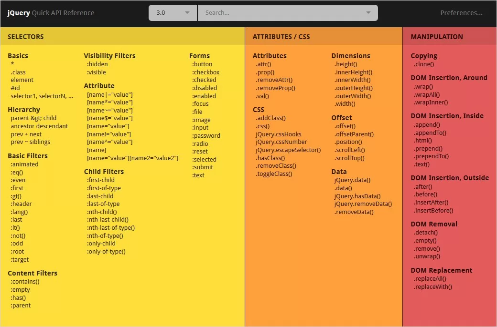
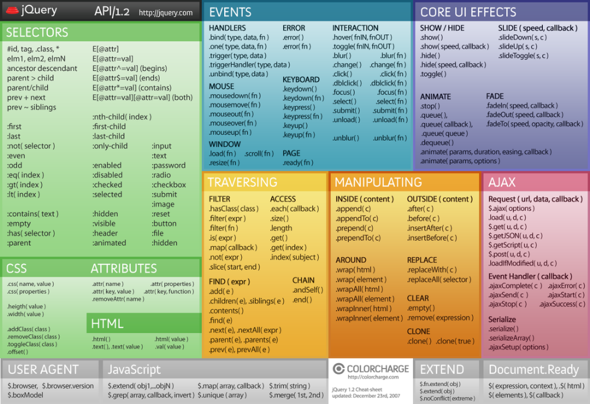

## Read: 02 - jQuery, Events, and The DOM
# JQUERY
- its a Javascript file used to find elements.
- `$('li.hot')` : is an example of a selector, it can be stored to a variable and meneppulate elements.
- `$('li.hot').addclass('compleat');` : is a method attatched to the selector to add a class. 
- its exellent to loop through elements.
### 

### 

### 
- CHECK if the page is ready to use by:
```javascript
$(document).ready(function(){});
// or
$(function (){});
// it creats a function-level scoop for its variables.
```
- there are three ways to rech elements in lists 
  - lt() to select index LESS THAN
  - eq() to select the element with index
  - gt() is to select index MORE THAN


