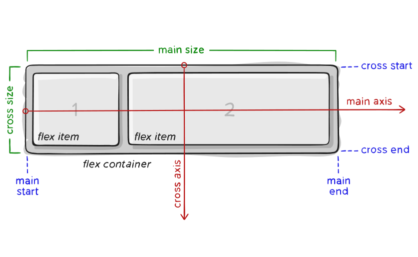
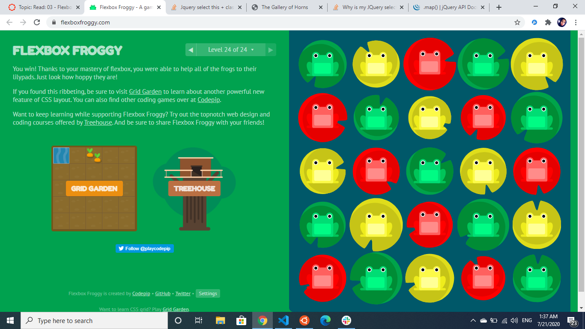

# Read: 03 - Flexbox and Templating

## TEMPLATING 
its away to render your code, its an HTMK markup with variables inserted for client view.
- Mustache:
``` javascript
Mustache.render(“Hello, {{name}}”, { name: “Sherlynn” });
// returns: Hello, Sherlynn
```
This is Mustache syntax to show that it is a placeholder,  Mustache is a specification for a templating language.

- Mustache-Express:
 Mustache Express lets you use Mustache and Express together easily.
 ``` javascript
 var nameObject = {"name": "Sherlynn"}
res.render('hello', nameObject)
```
 Whereby the first parameter ‘hello’ refers to the hello.html file (no need to include the extension (e.g. hello.html) as it has been previously set as html.

The second parameter would be the JSON data itself. We can also pass in a variable representing the data.


## FLLEX_BOX
 aims at providing a more efficient way to lay out, align and distribute space among items in a container, even when their size is unknown and/or dynamic.

 **Note**: Flexbox layout is most appropriate to the components of an application, and small-scale layouts, while the Grid layout is intended for larger scale layouts.

**for container** :
 display :flex/inline-flex;
This defines a flex container; inline or block depending on the given value. It enables a flex context for all its direct children.
- flex-direction : will reorder the children and align them ver/hor.
- flex-wrap : By default, flex items will all try to fit onto one line. You can change that and allow the items to wrap as needed with this property.
- align-items: This defines the default behavior for how flex items are laid out along the cross axis on the current line. 
- align-content :This aligns a flex container’s **lines** within when there is extra space in the cross-axis.

**Properties for the Children** :
- order : will change the order of the selected in the parent.
- flex-grow/flex-shrink: as it indicates if nessecery.
 ```javascript 
.item {
  flex-grow: 4; /* default 0 */
}
``` 
- flex-basis:This defines the default size of an element before the remaining space is distributed.
- align-self: horizantaly.

**PRACTICE**
[link](https://flexboxfroggy.com/).

 
 **BUGS**
[link](https://github.com/philipwalton/flexbugs).