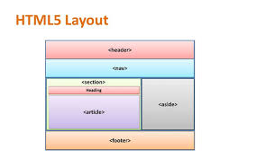

# Read: 01 - Introductory HTML and JavaScript

## **HTML**

### *STRUCTURE*
In HTML the code is build up in boxes "html - body - contenent".
Tags like (p,h1,h2) tells you about the info inside.
Tages are made of a left and right angle brakets and a character in between. but the closed tag has a forword slash in the front of the character.
Attributes tills more about the element itself.
The body may contain a head that contain info about the page (not visisble) and you might find in it the title.
You can see how other pages are built using source or view source.

### *EXTRA MARKUP*
- Different versions og HTML were produced over the years from 1998 untill HTML5 in 2000.
- Every one of the releases has a different DOCYPE begining naming the version so the browser identify it.
- Comments an be added using
```html
<!--comment here -->
```
- The id attribute is used to spatialise one element, but the class attribute is used foe muliple elements. Bothe are used for further perpoces in css or js.\

Elements can be:
- bloch elements: h1,p,ul or li.
- inline elements: a,b,img and em.
- to group elements and text in abox can be done using div.
- grouping text and inline elements is done by span.
- Iframe is used to display a window in your webpage (in frame) used commnely for google mapes.
- meta is used to describe info about the page.
- There are some characters used for spesific perpoces preserved in the html.

### *HTML5*
 The layot is 
 ### 


### *PROCESS AND DESIGN*

 Ask yourself:
- What is your site for?
- Why people visit your site?
- What your visitors are tring to acheave?
- What info needed?
- How often are you visited?
* You also need to make maps for your site to link the links. you can use wireframes to design the display.
* Its better to use colors and bold fonts and styles to take attention.
* Gouping in styles is important too.

## **JS**
### ABC'S
 A script is a series of instructions that a
computer can follow to achieve a goal. 
 To write a script, you need to first
state your goal and then list the tasks that need to be completed in order to achieve it.
            
* DEFINE THE GOAL
* DESIGN THE SCRIPT 
* CODE EACH STEP 
Start with the big picture of what you want to achieve, and break that down into smaller steps. Once you know the goal, you can work out the task that can be represented usind a flowchart.

 ### 


### 

then list some steps.
