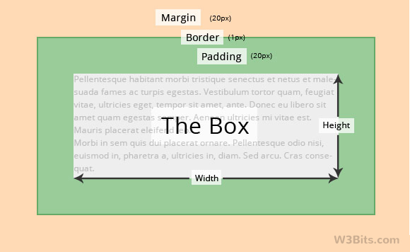

#Read: 03 - HTML Lists, CSS Boxes, JS Control Flow
## *HTML*
### **LISTS**
```html
<!DOCTYPE html>
<html>
<body>

<h2>An Unordered HTML List</h2>

<ul>
  <li>Coffee</li>
  <li>Tea</li>
  <li>Milk</li>
</ul>  

<h2>An Ordered HTML List</h2>

<ol>
  <li>Coffee</li>
  <li>Tea</li>
  <li>Milk</li>
</ol> 

</body>
</html>
```
## *CSS*
### **BOXES**
The box modle is divided to:
Content - The content of the box, where text and images appear
Padding - Clears an area around the content. The padding is transparent
Border - A border that goes around the padding and content
Margin - Clears an area outside the border. The margin is transparent

you can edit the lenghts as:
```css
div {
  width: 300px;
  border: 15px solid green;
  padding: 50px;
  margin: 20px;
}
```
## *JS*
* What we will practice is a new way to return and change elements in folders.since we knoe basic css and js 
we wont need alot to follow.
* We will be introduced to (tree of objects) and how it is organised.
## 

## 
* We will learn how to control elements in ways that inable us to animate!

as a start you should add this to the end of your code
```html
<script>
document.getElementById("demo").innerHTML = "Hello World!";
</script>
```
or
## 
The innerHTML Property
The easiest way to get the content of an element is by using the innerHTML property.
The innerHTML property is useful for getting or replacing the content of HTML elements.
## 
or
## 
The getElementById Method
The most common way to access an HTML element is to use the id of the element.

 with DOM you can:
 - Find HTML Elements
 - Change HTML Elements
 - Adding and Deleting Elements
 - Adding Events Handlers
 - Finding HTML Objects


for more indepth info:[khan-A]( https://www.khanacademy.org/computing/computer-programming/html-js-jquery/jquery-dom-access/a/project-dom-detective)
and
[w3school](https://www.w3schools.com/js/js_htmldom.asp)
