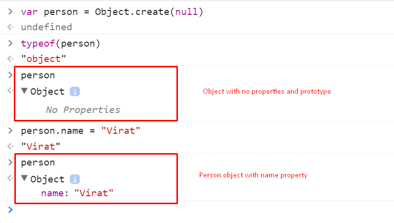

# Read: 04 - HTML Links, CSS Layout, JS Functions
<link href="style.css"></link>

## *HTML*

### **links**
- links are created by using ```<a>``` element.
```html
<a href="url">link text</a>
```
which contain opining-closing tags,the link and text.
-  you can use them to link pages outside you page or inside it.
## 
### **DIRECTORY STRUCTURE**
The directory structure is the organization of files into a hierarchy of folders. It should be stable and scalable; it should not fundamentally change, only be added to. Computers have used the folder metaphor for decades as a way to help users keep track of where something can be found.

## 

### **relative link type**
- Same Folder:
To link to a file in the same folder, just use the file
name. (Nothing else is needed.)
- Child Folder:
For a child folder, use the name of the child folder,
followed by a forward slash, then the file name.
- Grandchild Folder:
Use the name of the child folder, followed by a
forward slash, then the name of the grandchild
folder, followed by another forward slash, then the
file name.
- Parent Folder:
Use ../ to indicate the folder above the current one,
then follow it with the file name.
- GrandParent Folder:
Repeat the ../ to indicate that you want to go up
two folders (rather than one), then follow it with the
file name.
## 
- mailto: 
``` html
<a href="mailto:jon@example.org">Email Jon</a>
```
To create a link that starts up
the user's email program and
addresses an email to a specified
email address.
## 
- target : open in a
new window.
``` html
<a href="http://www.imdb.com" target="_blank">
Internet Movie Database</a> (opens in new window) 
```
## *css*
### **layout**
css can comlealy change the order of elements in it, some controls are:
- building blocks
- contain elements and control their possition(the defult flow is normal)
- make the site adaptable to differrent screens but fix some of the properties
- layot grid will hwlp you to know the dimentions you desire to choose in the page

## *JS*

### **Functions, Methods, and Objects**
- funtions are a group of statments that do aspesigic task for te object .
> calling , adding parameters, return value and update.
``` javascript
function name(){
    document.write('rania')
}
```
to call it 
> name();
when it needs parameters
> name(rania);
- variables are either local(inside the funtion) or global(outside).
- methods are created inside an object.
- the object groups together aset of variables and funtions to creat what you see in real world.

- build in obj's are used by the browser

## *6 Reasons for Pair Programming*
“two heads are better than one”. sharing the work of coding with partners will be grat because:
- Greater efficiency (find mistackes and fix them).
- Engaged collaboration (more focused).
- Learning from fellow students.
-  Social skills (This has long-term career impacts. As much as employers want strong programmers, they know it’s essential to hire people who can work well with others.)
-  Job interview readiness .
- Work environment readiness .

